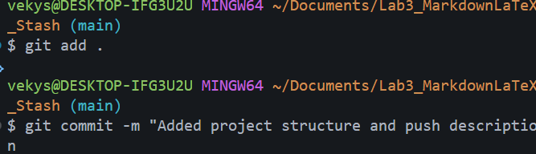

 Ссылки и изображения в Markdown

## Внешние ссылки

1. [GitHub](https://github.com)
2. [Официальный сайт Markdown](https://www.markdownguide.org "Перейти на официальный сайт")
3. [Visual Studio Code](https://code.visualstudio.com)

## Локальные изображения

